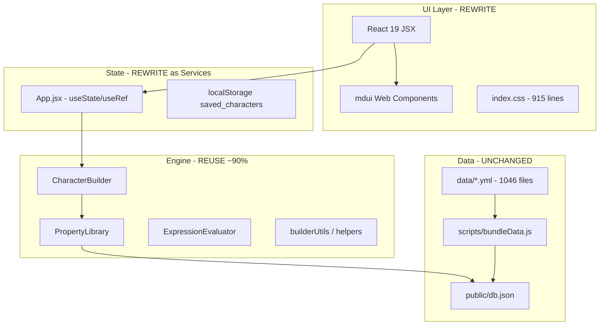

# Angular Material Port — Viability Assessment

## Verdict: **Viable — medium-scope rewrite, low architectural risk**

The app is a good candidate for an in-place Angular + Angular Material port. The hardest and most valuable code (the RPG engine) is already framework-agnostic. The UI surface is small. The main cost is rewriting ~14 React components and ~915 lines of mdui-themed CSS — not untangling legacy spaghetti.

**Important correction on scope:** This is **not** a legacy raw HTML/vanilla JS app. It is a **React 19 + Vite 7 SPA** using **mdui web components** for Material Design 3 chrome. The only "vanilla JS" is the engine layer under [`src/engine/`](src/engine/), which is a strength, not technical debt.

---

## Current Architecture

### Size inventory

| Layer | Files | Lines | Port action |
|-------|-------|-------|-------------|
| Engine | 6 | ~2,157 | Convert to TS services, keep logic |
| Screens | 4 | ~363 | Full Angular component rewrite |
| Components | 7 | ~1,366 | Full Angular component rewrite |
| App shell | 1 | 322 | → `AppComponent` + services |
| Utils | 2 | ~486 | Port `cardUtils` to Angular; keep `builderUtils` |
| CSS | 1 | 915 | Rewrite tokens for Material theming |
| Tests | 0 | 0 | Add during port (no safety net today) |

---

## What Carries Over Unchanged

- **[`data/`](data/)** — 1,046 YAML rule files; content authoring pipeline is UI-independent
- **[`scripts/bundleData.js`](scripts/bundleData.js)** — YAML → `public/db.json` bundler; wire into Angular `angular.json` as a prebuild script
- **[`public/db.json`](public/db.json)** — runtime data asset; served the same way via `HttpClient`
- **Engine logic** — [`CharacterBuilder.js`](src/engine/CharacterBuilder.js) (1,641 lines), [`PropertyLibrary.js`](src/engine/PropertyLibrary.js), [`ExpressionEvaluator.js`](src/engine/ExpressionEvaluator.js), [`pipeline.js`](src/engine/pipeline.js), [`helpers.js`](src/engine/helpers.js)

These classes use no React, no DOM, and no mdui. They map cleanly to injectable Angular services:

- `PropertyLibraryService` — loads `/db.json`, exposes property lookups
- `CharacterBuilderService` — owns builder instance, mutations, `getPropertyTree()` / `getCharacterData()`
- `CharacterStorageService` — `localStorage` persistence (key: `saved_characters`)

---

## What Gets Fully Replaced

### React UI (14 JSX files → Angular components)

| Current | Angular target |
|---------|----------------|
| [`App.jsx`](src/App.jsx) | `AppComponent` + shell layout |
| [`DashboardScreen.jsx`](src/screens/DashboardScreen.jsx) | `DashboardComponent` |
| [`BuilderScreen.jsx`](src/screens/BuilderScreen.jsx) | `BuilderComponent` |
| [`PlayScreen.jsx`](src/screens/PlayScreen.jsx) | `PlayComponent` |
| [`PrintScreen.jsx`](src/screens/PrintScreen.jsx) | `PrintComponent` |
| [`PropertySelectionTree.jsx`](src/components/PropertySelectionTree.jsx) | `PropertySelectionTreeComponent` (highest complexity — recursive forms) |
| [`CharacterSheet.jsx`](src/components/cards/CharacterSheet.jsx) | `CharacterSheetComponent` |
| [`ActivityCard.jsx`](src/components/cards/ActivityCard.jsx) | `ActivityCardComponent` |
| [`StatblockCard.jsx`](src/components/cards/StatblockCard.jsx) | `StatblockCardComponent` |
| [`cardUtils.jsx`](src/utils/cardUtils.jsx) | Angular pipe/directive or utility service for icon/term rendering |

Dead code to drop: [`DebugViewer.jsx`](src/components/DebugViewer.jsx) (unused), [`AutoFitContent.jsx`](src/components/AutoFitContent.jsx) (unused).

### mdui → Angular Material mapping

All mdui usage is in 12 runtime files. Every tag must be replaced — no config swap.

| mdui component | Angular Material equivalent | Used in |
|----------------|----------------------------|---------|
| `mdui-layout` / `mdui-layout-main` | `mat-sidenav-container` + `mat-sidenav-content` | App shell |
| `mdui-navigation-drawer` | `mat-sidenav` (mode="over") | Debug panel |
| `mdui-top-app-bar` / `mdui-top-app-bar-title` | `mat-toolbar` | All 4 screens |
| `mdui-button` | `mat-button` / `mat-flat-button` / `mat-stroked-button` | Widespread |
| `mdui-button-icon` | `mat-icon-button` | Widespread |
| `mdui-card` | `mat-card` | Dashboard, sheet, cards |
| `mdui-collapse` / `mdui-collapse-item` | `mat-expansion-panel` | Play screen, activity/statblock cards |
| `mdui-text-field` | `mat-form-field` + `matInput` | Builder forms |
| `mdui-select` / `mdui-menu-item` | `mat-select` + `mat-option` | Builder slot pickers |
| `mdui-badge` | `mat-badge` | Builder nav pending indicator |
| `mdui-segmented-button-group` | `mat-button-toggle-group` | Debug panel tabs |
| `mdui-divider` | `mat-divider` | Statblock cards |
| `mdui-icon` | `mat-icon` (Material Icons font already in [`index.html`](index.html)) | Widespread |
| `setColorScheme('#ee0feeff')` | Angular Material theme with custom primary palette | App init |

**Interop pain that goes away:** React+mdui timing hacks (e.g. `setTimeout(syncState, 0)` after select close in [`App.jsx`](src/App.jsx) lines 142–145) are eliminated with native Angular form controls.

### Other dependency swaps

| Current | Angular replacement |
|---------|---------------------|
| `react-markdown` + `remark-gfm` | `ngx-markdown` (3 files: ActivityCard, StatblockCard, PropertySelectionTree) |
| Vite + `@vitejs/plugin-react` | Angular CLI (`@angular/build`) |
| Custom Vite YAML HMR plugin | Prebuild script + optional file-watcher for dev |
| Tab state in `App.jsx` | Angular Router (`/`, `/builder`, `/play`, `/print`) |
| `react` / `react-dom` / `mdui` | Remove entirely |
| Dead deps: `axios`, `cheerio`, `turndown` | Do not port |

---

## CSS / Theming Migration

[`src/index.css`](src/index.css) (915 lines) mixes three concerns:

1. **mdui design tokens** (`--mdui-color-*`, `--mdui-shape-*`) — replace with Material 3 CSS variables from `@angular/material` theming
2. **Game-specific semantic colors** (`--color-action`, `--color-fire`, etc.) — portable as-is into `styles.scss`
3. **Layout + print styles** (~30% reusable) — character sheet grid, print `@media` rules transfer with selector updates (`mdui-card` → `mat-card`, etc.)

Theme seed color `#ee0feeff` (magenta) from [`App.jsx`](src/App.jsx) line 40 becomes the Angular Material primary palette.

---

## Build Tooling

Current Vite config ([`vite.config.js`](vite.config.js)) does two things beyond bundling:

1. Runs `bundleData.js` on startup — replicate as `"prebuild": "node scripts/bundleData.js"` and `"prestart": "node scripts/bundleData.js"` in `package.json`
2. YAML HMR via custom WebSocket event — **nice-to-have for dev**; can be reimplemented later with a Node file watcher or deferred to manual rebuild

Angular CLI handles dev server, production build, and asset copying (`public/` → `dist/`).

---

## Risk Assessment

| Risk | Severity | Mitigation |
|------|----------|------------|
| No existing tests | Medium | Add engine unit tests first (Jest/Karma) before UI port |
| `PropertySelectionTree` complexity (350 lines, recursive) | Medium | Port early; it is the builder's core interaction surface |
| `ExpressionEvaluator` uses `new Function()` | Low | Engine logic unchanged; works in browser same as today |
| `PlayScreen` ResizeObserver layout logic | Low | Port to `@ViewChild` + `ResizeObserver` or pure CSS |
| Print layout fidelity | Medium | Port print CSS carefully; test `window.print()` flow |
| YAML dev workflow regression | Low | Prebuild script covers production; HMR is dev convenience |
| Full TS conversion of 1,641-line `CharacterBuilder` | Medium | Incremental: add types at boundaries first, tighten internals later |

---

## Effort Estimate

| Phase | Effort | Notes |
|-------|--------|-------|
| Scaffold Angular + Material + Router + theme | 1–2 days | In-place replace of Vite/React tooling |
| Port engine to TS services + tests | 2–3 days | Highest reuse value |
| Port screens (4) + app shell | 2–3 days | Straightforward Material chrome |
| Port `PropertySelectionTree` + forms | 2–3 days | Hardest UI piece |
| Port card components + `cardUtils` | 2–3 days | Includes markdown rendering |
| CSS/theming + print styles | 1–2 days | Token migration |
| QA + polish | 2–3 days | Builder flow, save/load, print |
| **Total** | **~2–3 weeks** | Single developer, familiar with Angular |

---

## Recommended Migration Phases (in-place, full TypeScript)

Per your choices: **replace in place** and **full TypeScript**.

### Phase 0 — Scaffold and remove React
- `ng new` in repo root (or manual scaffold), configure `@angular/material`, standalone components, Angular Router
- Set up custom Material theme (primary `#ee0fee`)
- Wire `prebuild`/`prestart` for `bundleData.js`
- Delete `src/main.jsx`, React deps, mdui imports, Vite config

### Phase 1 — Engine as services (with tests)
- Convert [`src/engine/*`](src/engine/) to `.ts` with interfaces for `CharacterData`, `PropertyNode`, etc.
- `PropertyLibraryService`, `CharacterBuilderService`, `CharacterStorageService`
- Unit tests for pipeline, slot filling, expression evaluation

### Phase 2 — App shell + routing
- `AppComponent` with `mat-sidenav-container`, debug drawer, theme toggle
- Routes: `/` (dashboard), `/builder`, `/play`, `/print`
- Character state service with signals or RxJS (replaces `App.jsx` `useState`/`useRef`/`syncState` pattern)

### Phase 3 — Screens (in order)
1. **Dashboard** — simplest; validates save/load flow
2. **Builder** — `PropertySelectionTree` + category nav + `mat-form-field`/`mat-select`
3. **Play** — character sheet + activity cards + expansion panels
4. **Print** — print CSS + `window.print()`

### Phase 4 — Polish
- `ngx-markdown` for descriptions
- Print stylesheet parity
- Remove dead code and unused deps
- Update [`README.md`](README.md) and docs to reflect Angular stack

---

## What Makes This Viable

1. **Small UI surface** — 4 screens, 7 components; not a large enterprise app
2. **Clean separation** — engine has zero UI coupling
3. **Same design language** — mdui MD3 → Angular Material MD3 is a natural 1:1 component swap
4. **No backend** — static JSON + localStorage; no API layer to port
5. **Data pipeline unchanged** — YAML authoring workflow survives intact
6. **No URL routing today** — adding Angular Router is an improvement, not a regression risk

## What Makes This Non-Trivial

1. **100% UI rewrite** — every JSX file becomes a new Angular component; no incremental React+Angular coexistence in the chosen strategy
2. **Form-heavy builder** — `PropertySelectionTree` is recursive with slots, selects, number steppers
3. **No test safety net** — engine tests should be written as part of the port
4. **CSS rewrite** — 915 lines of mdui-specific selectors and tokens need Material equivalents

---

## Conclusion

**Proceed.** The port is architecturally sound: reuse the engine and data layer, rewrite the thin UI layer in Angular Material with TypeScript, replace Vite with Angular CLI, and drop React/mdui entirely. The ~2–3 week estimate is realistic for the current codebase size. The highest-value first step is scaffolding Angular and porting the engine to tested TypeScript services before touching any screens.
