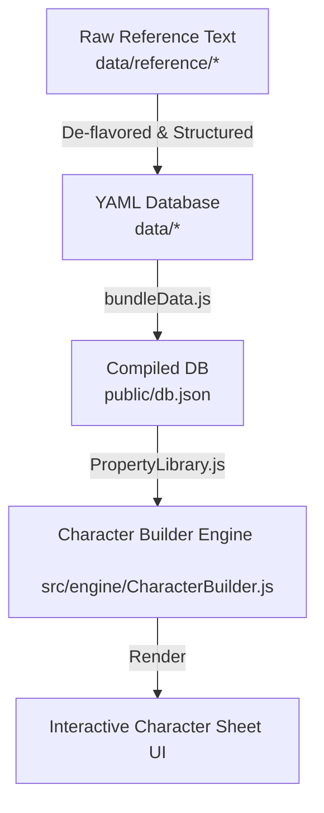

# RPG Database Authoring Reference

This document serves as the official reference for porting D&D 5e (2024) content from the raw reference files in `data/reference/` to the authored YAML files in `data/`. These files are bundled into `public/db.json` and interpreted dynamically by the character builder engine.

---

## 1. System Architecture & Porting Flow

The data pipeline operates in a unidirectional flow:



> [!IMPORTANT]
> The bundling script `scripts/bundleData.js` ONLY scans the `data/` directory for `.yml` and `.yaml` files. The raw reference files under `data/reference/` are completely excluded from compilation and exist purely for development reference.

---

## 2. Core System Constraints & Level Cap

The Character Builder application is designed around a strict level cap.

> [!WARNING]
> The global character level in `data/base.yml` is restricted to **levels 1 through 8** (`max: 8`).
> Any feature, ability, or subclass modification unlocked at **level 9 or higher** must be omitted from the YAML database.

### Guidelines for Level Capping:
1. **Omit High-Level Traits**: Do not write YAML declarations for features unlocked at level 9+ (e.g. Rogue Thief's *Supreme Sneak* at level 9 or *Use Magic Device* at level 13).
2. **Spell Lists Cap**: The spell database in `data/spells/` only implements spells up to **Level 4** (`level4Spells`). Spell slots and preparation rules for levels 5-9 are omitted.
3. **Graceful High-Level Fallbacks**: When a low-level ability scales at a higher level, you may include inline conditional logic (e.g., `$(meta.level >= 10 ? 2 : 1)d8`) to keep the formula robust, but do not create new nodes for high-level features.

---

## 3. Schematization Patterns & Node Types

Every database entry is a node in the property tree. The engine interprets the following node `type` configurations:

### `Folder`
Used as a container for top-level entities (Species, Classes, Subclasses, Backgrounds, Feats).
*   **Properties**:
    *   `id`: Unique identifier (usually lowerCamelCase). If omitted, defaults to the filename.
    *   `name`: Display name.
    *   `type`: Must be `Folder`.
    *   `tags`: Array of category tags (e.g., `[class]`, `[species]`, `[generalFeat]`).
    *   `description`: Short de-flavored paragraph.
    *   `children`: Array of child nodes.

```yaml
id: lifeDomain
name: Life Domain
type: Folder
tags:
  - clericSubclass
children:
  - id: subclassName
    type: Effect
    target: meta.sub
    operation: set
    value: "Life"
```

### `Activity`
Represents an action, spell, or ability that renders as an interactive card on the sheet.
*   **Properties**:
    *   `id` / `name` / `type: Activity`
    *   `time`: Action economy type (`action`, `bonus action`, `reaction`, `free action`, `minute`, etc.).
    *   `range`: Distance constraint (e.g., `self`, `30 feet`, `touch`).
    *   `duration`: Spell/ability duration (e.g., `Instantaneous`, `1 round`, `10 minutes`).
    *   `resource`: Resource key consumed (e.g., `channelDivinity`, `level1SpellSlot`).
    *   `condition`: JavaScript expression determining visibility (e.g., `$(meta.level >= 3)`).
    *   `description`: Simplified description string.
    *   `extra`: Array of extra properties (e.g., higher-level spell slot effects).

```yaml
id: guidedStrike
type: Activity
name: Guided Strike
time: reaction
range: 30 feet
duration: Instantaneous
resource: channelDivinity
condition: $(meta.level >= 3)
description: "When you or a creature within range misses with an attack roll, you give that roll a +10 bonus."
```

### `Effect`
Applies dynamic alterations to the character's properties.
*   **Properties**:
    *   `target`: Dot-notation path to the character property.
    *   `operation`: Operation type:
        *   `set`: Overwrites the target field.
        *   `add`: Adds a numeric value (automatically parses formats like `X feet` and expressions).
        *   `push`: Appends an item to an array (avoiding duplicates).
        *   `softSet`: Sets value only if currently null or undefined.
        *   `replace`: Replaces a substring using `target: path["substring"]`.
    *   `value`: The value to apply (can contain expressions).
    *   `condition`: Conditional expression.

```yaml
# Add 1 to the ASI Choice Pool
type: Effect
target: attributes.asiPoolLimit
operation: add
value: 1
```

### `Slot`
Defines an interactive selection slot presented to the user during character creation/level-up.
*   **Properties**:
    *   `id` / `name` / `type: Slot`
    *   `target`: Query string matching tags to filter eligible items (e.g., `feat`, `cleric AND cantrip`).
    *   `quantity`: Number of choices allowed.
    *   `overwrite`: Field overwrites applied to whatever item is slotted into this position.

```yaml
id: versatile
name: Versatile
type: Slot
target: originFeat
quantity: 1
```

### `Extra`
A simplified macro to append rules text to a target card's `extra` list.
*   **Properties**:
    *   `id` / `name` / `type: Extra`
    *   `target`: The ID of the activity card to append the text to.
    *   `description`: The rule text to append.

```yaml
id: discipleOfLife
type: Extra
name: Disciple of Life
target: healingSpell
condition: $(meta.level >= 3)
description: "The creature regains an additional $(2+(stats.wis.mod)) Hit Points."
```

### `Reference`
Imports another database node by ID, supporting condition filters and property overwrites.
*   **Properties**:
    *   `type: Reference`
    *   `target`: ID or array of IDs to reference.
    *   `overwrite`: Overrides properties of the referenced node (e.g., changing resource cost or range).

```yaml
# Add Guiding Bolt to prepared list but change its resource cost
type: Reference
target: [guidingBolt]
condition: $(meta.level >= 3)
overwrite:
  resource: starMap
```

### `Resource`
Defines a trackable counter pool on the character sheet.
*   **Properties**:
    *   `id` / `name` / `type: Resource`
    *   `quantity`: Math expression for pool capacity (e.g., `$(Math.max(1, stats.wis.mod))`).
    *   `sr`: Quantity restored on a Short Rest (automatically generates a short rest restore card).

```yaml
id: channelDivinity
type: Resource
name: Channel Divinity
quantity: "$(meta.level >= 18 ? 4 : meta.level >= 6 ? 3 : 2)"
sr: 1
condition: $(meta.level >= 2)
```

### `Statblock`
Defines companion, mount, or summon creature sheets.
*   **Properties**:
    *   `type: Statblock`
    *   `name` / `id` / `size` / `category` / `classification`
    *   `ac` / `hp` / `movement` / `stats` / `senses`
    *   `traits`: Array of `{ name, description }` objects.
    *   `actions`: Array of `{ name, description }` objects.

```yaml
type: Statblock
name: Beast of the Sea
id: beastOfTheSea
category: companion
classification: Beast
ac: $(13 + stats.wis.mod)
hp: $(5 + 5 * meta.level)
stats:
  str: 14
  dex: 14
  con: 15
  int: 8
  wis: 14
  cha: 11
```

---

## 4. Simplification & De-Flavoring Rules

To make content fit cleanly onto character sheet cards, all mechanical fluff must be removed.

### Rule 1: Remove Redundant Field Wording
Do not describe in natural language details that are defined in fields.
*   *Incorrect*: "As a Bonus Action, you can take a magic action to..."
*   *Correct*: Set `time: bonus action` and describe the core effect: "You make a..."
*   *Incorrect*: "You can use this feature a number of times equal to your Wisdom modifier..."
*   *Correct*: Define a `Resource` with `quantity: $(Math.max(1, stats.wis.mod))` and link the activity via `resource: [name]`. Describe only what the activity does on use.

### Rule 2: Strip out Flavor Text
Exclude extensive lore paragraphs from the reference. The `description` field at the Folder level should be limited to 1-2 thematic sentences.

### Rule 3: Split Multi-Form Entities
When a spell or class feature summons creatures with environment-specific variables (e.g., *Summon Beast* having Land, Water, and Air forms), do not create a single complex statblock with conditional expressions. Split them into separate YAML files (e.g. `bestialSpiritLand.yml`, `bestialSpiritWater.yml`) and reference them collectively in the parent spell Folder.

---

## 5. Verbiage & Dynamic Expressions

Rather than hardcoding numerical bonuses, the engine utilizes dynamic evaluation using the `$(...)` expression syntax.

| Mechanic | Raw Reference | YAML Verbiage Expression |
| :--- | :--- | :--- |
| **Spell Attack Roll** | "Make a ranged spell attack..." | `Make a $(formatBonus(attributes.spellcasting.attack)) ranged spell attack...` |
| **Saving Throw DC** | "Wisdom saving throw" | `DC $(attributes.spellcasting.save) Wisdom saving throw` |
| **Damage/Healing Modifier** | "+ 2 + Wisdom modifier" | `$(2 + stats.wis.mod)` |
| **Self-Referential Range** | "...within 30 feet of you..." | Use `within range` (since `range: 30 feet` is defined in the activity fields) |
| **Proficiency Bonus Scaling** | "...equal to your Proficiency Bonus" | `$(attributes.prof)` |

### Formats & Typography:
*   **Attack Action header**: Bold and italicize attack descriptions: `_Melee Attack Roll:_ $(...) to hit` or `_Hit:_ ...`
*   **Option Lists**: Bold bullet points cleanly: `**Option Name.** Description of option.`
